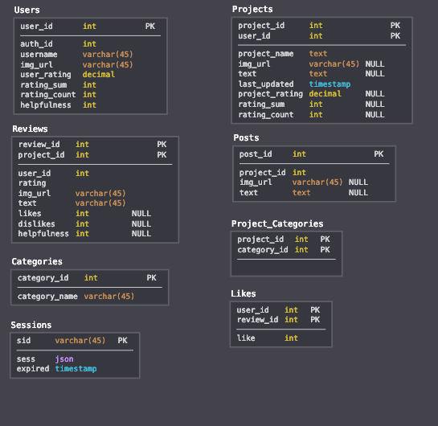

# Qraft

Qraft is a web application to find DIY projects to build and review projects added by the community. Find a project by searching for a category and browse all the available projects or click on a popular maker to view projects added by that user. Once you find a project, click on it to view all of the posts added by the maker. The application allows users to login to add new personal DIY projects or to add a review to an existing project.

## Team

[Max Kajiwara](https://github.com/maxkajiwara)

[Alejandro Krasovsky](https://github.com/alejandrok93)

[David Benavidez](https://github.com/DavidBenavidez123)

[Michael Agard](https://github.com/michaelagard)

[Tristen Neu](https://github.com/tristenneu)

## Tech Stack

Qraft is set up to automatically deploy when updates are pushed to the master branch. It utilizes Heroku and Netlify for deployment. The web application is built in full stack Javascript with React and Redux on the frontend and Node and Express in the backend.

**Font-End**

- React
  - Fast render to the browser with React's virtual DOM
  - Component based architecture allowed for "build once, use anywhere" UI components
  - Industry standard for building large scale web applications
  - Large open source tools available for styling
- Redux
  - Maintain web application state in a single source of truth
  - Strict organization for user actions makes code easier to understand

**Back-End**

- Node

  - Easy to work with existing packages that extend functionality
  - Provides flexibility to use middleware
  - Allows for using Javascript in the backend

- Express
  - Easy set up of web API
  - Provides flexibility to use middleware

# Setup

1. Clone the repository
2. Create a `.env` file inside the server/ folder with the following content

```

AUTH0_CLIENT_ID=<<AUTH0_CLIENT_ID>>
AUTH0_DOMAIN=<<AUTH0_DOMAIN>>
AUTH0_CLIENT_SECRET=<<AUTH0_CLIENT_SECRET>>
AWS_ACCESS_KEY_ID=<<AWS_ACCESS_KEY_ID>>
AWS_SECRET_KEY=<<AWS_SECRET_KEY>>
DATABASE_URL= <<DATABASE_URL>>

```

3. Run `yarn` inside reactapp/ and server/ folders to install dependencies
4. Run `yarn start` inside reactapp/ and server/ folders to start the web application and the server

# API Endpoints

| Method | Endpoint                                | Request                                | Response                               |
| ------ | --------------------------------------- | -------------------------------------- | -------------------------------------- |
| GET    | /api/users/user                         |                                        | Object of logged in user info          |
| POST   | /api/users/myprojects                   | User ID                                | Array of user projects                 |
| POST   | /api/users/myreviews                    | User ID                                | Array of user reviews                  |
| POST   | /api/users/editusername                 | User ID                                | Status of username change              |
| POST   | /api/users/editprofilepic               | User ID                                | Status of profile picture change       |
| GET    | /api/projects/:project_id               | Project ID                             | Object of project                      |
| POST   | /api/projects/                          | User ID, Project Name, Text            | Project ID                             |
| PUT    | /api/projects/:project_id               | Project ID                             | Object with count of projects updated  |
| DELETE | /api/projects/:project_id               | Project ID                             | Object with count of projects affected |
| GET    | /api/:project_id/reviews/:user_id       | Project ID, User ID                    | Array of objects of reviews            |
| POST   | /api/posts/                             | User ID, Project ID, text              | Object of post id                      |
| PUT    | /api/posts/                             | User ID, Project ID                    | Object with count of posts affected    |
| DELETE | /api/posts/                             | User ID, Project ID                    | Object with count of posts affected    |
| GET    | /api/reviews/:review_id/:user_id        | User ID, Review ID                     | Object with review                     |
| POST   | /api/reviews/                           | User ID, Project ID, Rating, Text      | Object with Review ID                  |
| PUT    | /api/reviews/:review_id                 | User ID, Review ID, Project ID, Rating | Object with Review ID                  |
| DELETE | /api/reviews/:review_id                 | User ID, Review ID                     | Status of review deleted               |
| PUT    | /api/reviews/:review_id/like            |                                        | Object with updated likes              |
| GET    | /api/reviews/getid/:user_id/:project_id | User ID, Project ID                    | Object with review ID                  |
| GET    | /api/lp/projects                        |                                        | Array of objects of projects           |
| GET    | /api/lp/makers                          |                                        | Array of objects of makers             |
| GET    | /api/lp/reviewers                       |                                        | Array of objects of reviewers          |
| GET    | /api/search/                            | Query                                  | Array of results                       |
| GET    | /api/filter/                            | Query                                  | Array of results                       |

# Data Model


